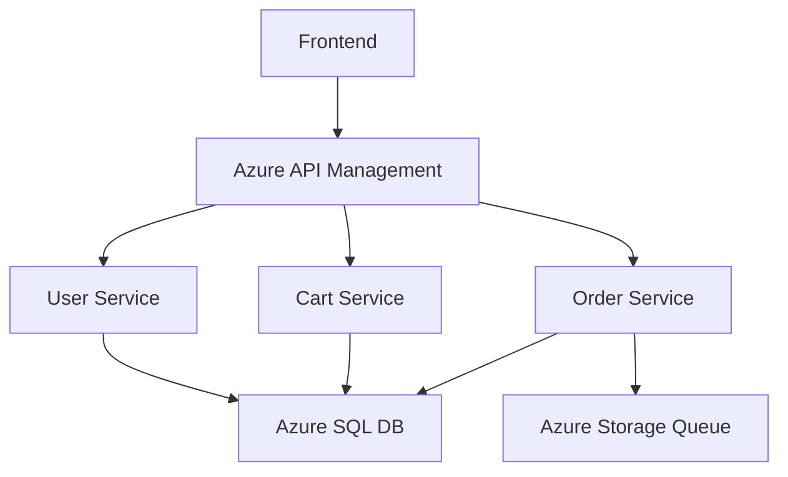
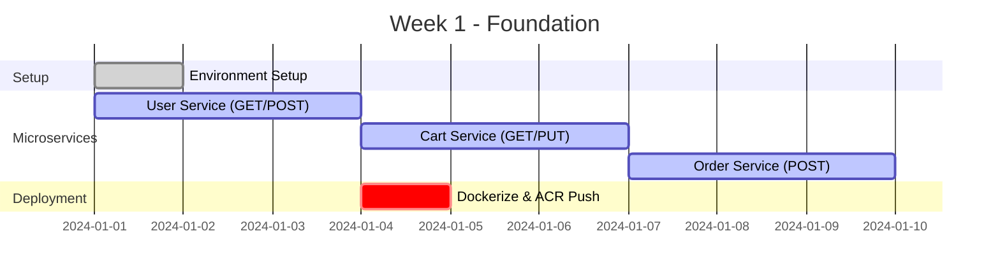
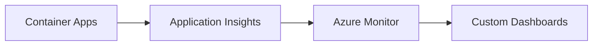

# Azure Microservices E-Commerce System 🚀

[](https://azure.microsoft.com/en-us/products/container-apps/)
[](https://dotnet.microsoft.com/)
[](LICENSE)

A cloud-native e-commerce microservices system built with .NET 8, Docker, and Azure Free Tier services, implementing API-first and Zero Trust architectures.

## 📋 Project Overview


## 🛠️ Tech Stack
| Component | Technology |
|-----------|------------|
| Microservices | .NET 8 Minimal API |
| Containerization | Docker + Azure Container Apps |
| API Gateway | Azure API Management (Developer) |
| Database | Azure SQL DB (Free Tier) |
| Event-Driven | Azure Storage Queue |
| CI/CD | GitHub Actions |
| Infrastructure | Bicep (IaC) |
| Security | Azure AD + Managed Identities |

## 📅 4-Week Implementation Plan
### Week 1: Core Setup



### Week 2-4: Advanced Integration
| Week | Focus Area | Key Tasks |
|------|------------|-----------|
| 2 | API Management & Auth | • APIM Developer Tier Setup<br>• Azure AD JWT Integration<br>• Storage Queue Eventing |
| 3 | DevSecOps | • GitHub Actions CI/CD<br>• Bicep Infrastructure<br>• Trivy Container Scanning |
| 4 | Zero Trust & Demo | • Managed Identities<br>• k6 Load Testing<br>• Final Presentation |

## 🚀 Getting Started
### Prerequisites
- Azure Student Account ($100 credit)
- Docker Desktop
- .NET 8 SDK

### Quick Deployment
```bash
# Deploy infrastructure with Bicep
az deployment group create \
  --resource-group myResourceGroup \
  --template-file main.bicep

# Deploy microservices
az containerapp up \
  --name userservice \
  --source ./UserService \
  --resource-group myResourceGroup
```

## 🌐 Architecture


## 📊 Monitoring


## 📜 License
MIT License - See LICENSE for details.